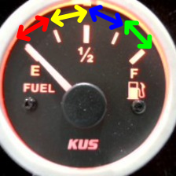

# Image classification example

This example demonstrates the usage of two OAAX runtime libraries, one dedicated for CPU and the other for Hailo-8, to load a gauge reader model trained on the TeachableMachine platform.

The deployment process of this model on the two chips involves compiling the model using the chip's corresponding conversion toolchains, then running the two generated optimized models using the adequate runtime for each.

## Folder overview

This folder contains the source code of a C program that will load the runtime library, load the model, and run it on a
sample image.
The program will print the output of the model to the console to confirm the model's output.

The `artifacts/` directory contains the following files:

- `model.onnx`: the trained TeachableMachine model exported as ONNX.
- `image.jpg` and `image2.jpg`: two sample images that will be used to evaluate the model.

The `cpu-artifacts` contains a shell script (`compile-model.sh`) that's used to compile the model using the conversion toolchain dedicated for the CPU runtime.   
This folder should contain the downloaded conversion toolchain and runtime before running this example.

Likewise, the `hailo-artifacts` contains a shell script for compilation, and should contain the Hailo toolchain and runtime before running the example.
Additionally, it contains a set of images (`images/`) that will be used for calibrating the model during quantization and a JSON file (`info.json`) that contains the conversion configuration.

> The source code of the example is available in the `src/` directory.

## Model
The model used in this example is a classification model that outputs 4 probability values depending on where the gauge needle points.

The image below shows the four area of the gauge range that our model is expected to recognize:   


If the needle points at the red area, the model will have the highest probability in the first entry of the output list. Similarly, when the needle points at the yellow, blue or gree area, the model will have the highest  probability in the second, third or fourth entry respectively.

## Requirements

> In order to run this example, a Hailo-8 chip must be attached to an x86_64 machine with an Ubuntu 20.04 (or higher).

The OAAX artifacts needed to run this example can be found in the [contributions](https://github.com/OAAX-standard/contributions) repository, namely the CPU toolchain and runtime, and the Hailo ones.   
For each chip, the toolchain and runtime must be placed in their adequate folder (`cpu-artifacts` for CPU or `hailo-artifacts` for Hailo).

Also, make sure that libjpeg is installed on the machine. You can install it using the following command:

```bash
sudo apt-get install libjpeg-dev
```

## Getting started

Assuming you have the required dependencies installed, the first step is to compile the model to optimized formats for both CPU and Hailo-8.
The `cpu-artifacts/` and `hailo-artifacts` contain a script for doing that from start to end, given that the toolchain Docker images are placed in those folders.
> For Hailo, you also need to add `hailo_dataflow_compiler-...linux_x86_64.whl`, `hailort_..._amd64.deb`, and `hailort-...-cp38-cp38-linux_x86_64.whl` inside `hailo-artifacts/hailo_deps`. You can download them from Hailo's Developer Zone.

For example, to compile the model for CPU, you can run this command:
```bash
cd image-classification-example/cpu-artifacts
bash compile-model.sh
```
At the end of the execution and new model file named `model-simplified.onnx` will be created inside the `image-classification-example/artifacts` folder.

Similarly, after compiling the model for Hailo-8, a new model file named `model.hailo8.onnx` will be created inside the `image-classification-example/artifacts` folder.

> In summary, after the two model compilation steps, 2 optimized models should be available inside the `artifacts/` folder.

To build the example using the following commands:

```bash
cd image-classification-example
mkdir build
cd build
cmake ..
make
```

After compiling the source code, we can run the gauge reader model on CPU using this command:

```bash
./c_example ./cpu-artifacts/libRuntimeLibrary.so ./artifacts/model-simplified.onnx  ./artifacts/image.jpg # or image2.jpg
```

To run the model on Hailo-8, we need to first of all, expose the location of Hailo shared libraries for the linker by running this commad:
```bash
export LD_LIBRARY_PATH=./hailo-artifacts
```
Then, we can run the model using:
```bash
./c_example ./hailo-artifacts/libRuntimeLibrary.so ./artifacts/model-simplified.onnx  ./artifacts/image.jpg # or image2.jpg
```

The program will print the output of the model to the console, along with some additional verbosity.